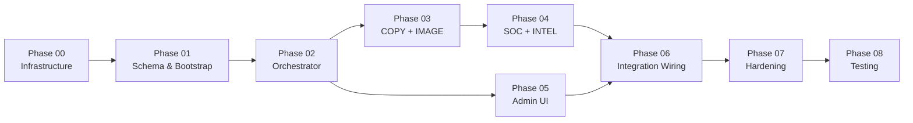

# Build Plan: ELM Marketing Engine
**Version:** 1.0
**Spec:** elm-marketing-engine-spec-v2.md (LOCKED)
**SOW:** elm-marketing-engine-sow.md
**Date:** 2026-04-04

---

## Dependency Graph

**Parallelizable:** Phase 03 (agents) and Phase 05 (admin UI) can run concurrently — different repos, no file conflicts.

---

## Phase Summary

| Phase | Name | Repo | SOW Features | Complexity | Max Turns | Est. Time |
|-------|------|------|-------------|------------|-----------|-----------|
| 00 | Infrastructure & repo setup | elm-marketing + easternLM | F-003 | Low | 25 | 1-2 hrs |
| 01 | Schema, migrations, brand bootstrap | elm-marketing | F-002, F-003 | Medium | 50 | 2-3 hrs |
| 02 | Orchestrator agent | elm-marketing | F-001, F-007, F-008, F-016 | High | 75 | 4-6 hrs |
| 03 | COPY + IMAGE agents | elm-marketing | F-004, F-005 | High | 75 | 4-6 hrs |
| 04 | SOC + INTEL agents | elm-marketing | F-009, F-010, F-011, F-012, F-013, F-014 | High | 75 | 4-6 hrs |
| 05 | Admin Marketing tab + photo capture | easternLM | F-006, F-015 | High | 75 | 4-6 hrs |
| 06 | Integration wiring & draft-only mode | both | F-009, F-014 | Medium | 50 | 2-3 hrs |
| 07 | Hardening & observability | elm-marketing | S-006, S-008, S-019, S-020 | Medium | 50 | 2-3 hrs |
| 08 | Testing | both | — | Medium | 50 | 2-3 hrs |

---

## SOW Feature Traceability

| Feature | Phase(s) | Status |
|---------|----------|--------|
| F-001 Orchestrator agent | 02 | ⬜ |
| F-002 Brand memory system | 01, 02 | ⬜ |
| F-003 Multi-brand architecture | 00, 01 | ⬜ |
| F-004 Social media copy generation | 03 | ⬜ |
| F-005 Product & project imagery | 03 | ⬜ |
| F-006 Photo ingestion pipeline | 05 | ⬜ |
| F-007 Weekly content calendar | 02 | ⬜ |
| F-008 Content pillar rotation | 02 | ⬜ |
| F-009 Auto-publish to IG & FB | 04, 06 | ⬜ |
| F-010 Google Business Profile posts | 04, 06 | ⬜ |
| F-011 Review response drafts | 04 | ⬜ |
| F-012 Competitor monitoring | 04 | ⬜ |
| F-013 Analytics & reporting | 04 | ⬜ |
| F-014 Review solicitation | 04, 06 | ⬜ |
| F-015 Content approval dashboard | 05 | ⬜ |
| F-016 Scheduled automation | 02 | ⬜ |

---

## Execution Guidance

**Two-repo workflow:**
- Phases 00-04, 06-08 run against the `elm-marketing` repo (SSH to VPS or local)
- Phase 05 runs against the `easternLM` repo on the `feature/marketing-ui` branch
- Phase 06 touches both repos (webhook in easternLM, wiring in elm-marketing)

**Per-phase workflow:**
1. Paste phase prompt into Claude Code
2. Run with `claude --max-turns [N]` per table above
3. If turn limit hit, resume with `claude --continue`
4. On completion, review the agent's completion report
5. Optionally paste review prompt into separate session for meta-agent QA
6. PROMOTE → next phase, FIX → re-run, ESCALATE → manual intervention

**Branch strategy:**
- `elm-marketing` repo: develop on `dev`, merge to `main` when stable
- `easternLM` repo: develop on `feature/marketing-ui` off `main`; minor fixes continue on `main` separately; rebase feature branch periodically

---

## Rollback Strategy

| Phase | Rollback |
|-------|----------|
| 00 | Delete `/opt/elm-marketing/` and feature branch |
| 01 | Drop all `mktg_*` tables and enums via rollback migration |
| 02 | `docker compose down` orchestrator container |
| 03 | `docker compose down` copy + image containers |
| 04 | `docker compose down` soc + intel containers |
| 05 | `git checkout main` on easternLM (feature branch untouched) |
| 06 | Revert webhook route in easternLM; disable cron in marketing engine |
| 07 | Revert hardening configs (kept in separate commits) |
| 08 | Tests are additive; no rollback needed |
